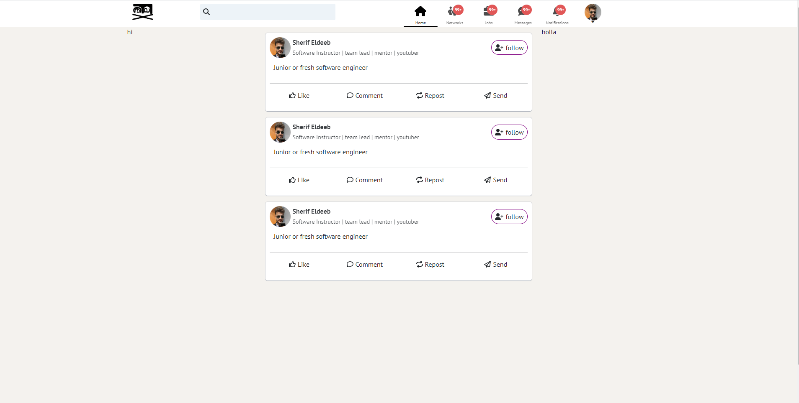

# FaceX Website [FACEX](https://facex-frontend.onrender.com)



This social media website Inspired by ( [facebook](https://facebook.com), [linkedin](https://linkedin.com) and [x](https://x.com) (Twitter previously)).

- We use React Vite TS `npm create vite@latest` For Building This Website (FACEX)

## Expanding the TS Configuration File

If you are developing a production application, we recommend updating the configuration to enable type aware TS rules:

- this code under blow is for the `tsconfig.json` file

```js
{
  "compilerOptions": {
    "target": "ES2020",
    "useDefineForClassFields": true,
    "lib": ["ES2020", "DOM", "DOM.Iterable"],
    "module": "ESNext",
    "skipLibCheck": true,

    /* Bundler mode */
    "moduleResolution": "bundler",
    "allowImportingTsExtensions": true,
    "resolveJsonModule": true,
    "isolatedModules": true,
    "noEmit": true,
    "jsx": "react-jsx",

    /* Linting */
    "strict": true,
    "noUnusedLocals": true,
    "noUnusedParameters": true,
    "noFallthroughCasesInSwitch": true
  },
  "include": ["src"],
  "references": [{ "path": "./tsconfig.node.json" }]
}
```

- this code under blow is for the `tsconfig.node.json` file

```js
{
  "compilerOptions": {
    "composite": true,
    "skipLibCheck": true,
    "module": "ESNext",
    "moduleResolution": "bundler",
    "allowSyntheticDefaultImports": true,
    "outDir": "./build"
  },
  "include": ["vite.config.ts"]
}
```

- React-TS App File STructure

  src/
  assets
  components
  constants
  functions
  middleware
  pages
  routes
  sass
  scss
  services
  store
  utils
